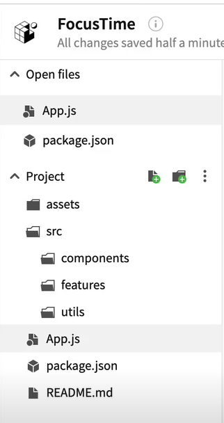

# Sample Snack app

Open the `App.js` file to start writing some code. You can preview the changes directly on your phone or tablet by scanning the **QR code** or use the iOS or Android emulators. When you're done, click **Save** and share the link!

When you're ready to see everything that Expo provides (or if you want to use your own editor) you can **Download** your project and use it with [expo cli](https://docs.expo.dev/get-started/installation/#expo-cli)).

All projects created in Snack are publicly available, so you can easily share the link to this project via link, or embed it on a web page with the `<>` button.

If you're having problems, you can tweet to us [@expo](https://twitter.com/expo) or ask in our [forums](https://forums.expo.dev/c/expo-dev-tools/61) or [Discord](https://chat.expo.dev/).

Snack is Open Source. You can find the code on the [GitHub repo](https://github.com/expo/snack).

## Rough Notes

- https://snack.expo.dev/@abhimvp/focustime

- follow best practices where working on react native project : starting with folder structure .

- App.js is holding everything together- which is going to create the base of your application. - entry file.

- export default function App() → telling RN it exports one main thing. APP this is the thing that pulls everything together. better to use `styleSheet.create` instead of writing inside of component like {{flex:1}}



- how do we actually get our content to always stay within the frame? Also not every phone has exact notch phase and also the pixels we mention in StyleSheet is not actual pixels they are density based pixels means means padding 50 looks different on Ios and different on Android & we solve that by using `platform` - that allows you to target IOS and Android Separately & also we make use of [SafeAreaView](https://reactnative.dev/docs/safeareaview) - The purpose of `SafeAreaView` is to render content within the safe area boundaries of a device. It is currently only applicable to iOS devices with iOS version 11 or later. - But on Android we see that text over the status bar & how can we avoid that - we can avoid that using StatusBar from reactNative and SafeAreaView is only for IOS and ignores the padding styles we provide to it as per documentation so for both IOS and Android , our code looks something like this :

```jsx
import { Text, SafeAreaView, StyleSheet, Platform,StatusBar } from 'react-native';

export default function App() {
  return (
    <SafeAreaView style={styles.container}>
      <Text> namaskaram annaa</Text>
    </SafeAreaView>
  );
}

const styles = StyleSheet.create({
  container: {
    flex: 1,
    padding:Platform.OS=='android'? StatusBar.currentHeight:0
  },
});

```

- https://callstack.github.io/react-native-paper/ for text Input

- `useState` Hook from **React** that allows us to store values during the component lifecycle.If you render the same component multiple times, each will get its own state. Functions starting with `use` are called _Hooks_. `useState` is a built-in Hook provided by React. You can find other built-in Hooks in the [API reference.](https://react.dev/reference/react) You can also write your own Hooks by combining the existing ones.Hooks are more restrictive than other functions. You can only call Hooks _at the top_ of your components (or other Hooks). If you want to use `useState` in a condition or a loop, extract a new component and put it there.
- https://react.dev/learn/thinking-in-react

- React components are JavaScript functions that return markup.

```jsx
function MyButton() {
  return <button>I'm a button</button>;
}
```

- React component names must always start with a capital letter, while HTML tags must be lowercase.

- The `export default` keywords specify the main component in the file.If you’re not familiar with some piece of JavaScript syntax, [MDN](https://developer.mozilla.org/en-US/docs/web/javascript/reference/statements/export) and [javascript.info](https://javascript.info/import-export) have great references.

**Writing markup with JSX**

- The markup syntax you’ve seen above is called _JSX_. It is optional, but most React projects use JSX for its convenience.JSX is stricter than HTML. You have to close tags like `<br />`. Your component also can’t return multiple JSX tags. You have to wrap them into a shared parent, like a `<div>...</div>` or an empty `<>...</>` wrapper:

```jsx
function AboutPage() {
  return (
    <>
      <h1>About</h1>
      <p>
        Hello there.
        <br />
        How do you do?
      </p>
    </>
  );
}
```

JSX lets you put markup into JavaScript. Curly braces let you “escape back” into JavaScript so that you can embed some variable from your code and display it to the user.

```jsx
return <h1>{user.name}</h1>;
```

`style={{}}` is not a special syntax, but a regular `{}` object inside the `style={ }` JSX curly braces. You can use the `style` attribute when your styles depend on JavaScript variables.

[Conditional Rendering](https://react.dev/learn#:~:text=Conditional%20rendering) in React

https://react.dev/learn Covers all most 80% of features we use daily.

`useState` will cause a reRender

`useRef` will not , & also a ref only returns you one object in which you can set it to whatever variable you want & if the variable changes , it won’t cause reRenders

`setInterval` is a function in JavaScript

https://callstack.github.io/react-native-paper/docs/components/ProgressBar/

https://reactnative.dev/docs/vibration - **On Android,** the odd indices of the `pattern` array represent the vibration duration, while the even ones represent the separation time. **On iOS,** the numbers in the `pattern` array represent the separation time, as the vibration duration is fixed.

- always go through react documentation to understand what each component does exactly & how it works & what specifically we can do with them. As they change according to react native upgrades.

- https://docs.expo.dev/versions/latest/sdk/keep-awake/ - A React hook to keep the screen awake for as long as the owner component is mounted.

- https://reactnative.dev/docs/flatlist - A performant interface for rendering basic, flat lists
